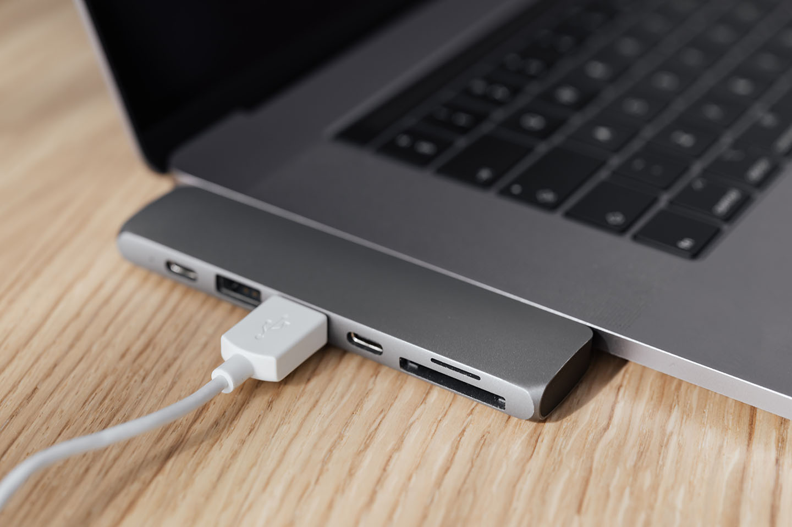

MacBook系列產品以極簡設計聞名，美觀的外型令人愛不釋手。有幸近期我也入手了一台MacBook Pro，感受一下什麼是「潮到出水」的滋味。在使用了一段時間後，發現它有其方便，也有其不便的地方。今天我們來談談MacBook Pro USB外接的問題，這個部分令我感觸尤深。

我的MacBook Pro是2019低階款，僅有2個TB3插孔。購買前我有做過功課，明白可以經由插上USB Type-C擴充hub外接多種設備，因此不致於有擴充性的問題吧？在實際上使用之後，發現這個問題真的其實還蠻大條的。

### 擴充hub百百種，我該選哪一款？

---

市面上Type-C的擴充hub款式五花八門，價格落差也很大。對於沒有hub使用性就大打折扣的MacBook來說，這是必須隨著電腦購買的必要配件。而官方並沒有一套選購認證，協助消費者挑選品質優良的hub，買hub有點像是在踩地雷一樣。我手上有一個故障的hub，PD供電不知為何燒掉，連帶MacBook充不進電，只能回蘋果門市討救兵。如果不想賭一把，我想購買蘋果官方的hub會比較好，雖然外接的數量少了很多，相對沒有那麼方便，但是既然是官方推出的產品，品質應該有一定水準。

### 擴充hub上有一個Type-C插孔，我能用它接其他設備嗎？

---

通常hub預留的一個Type-C插孔，是讓你方便接電源用的，並不能用來傳輸資料。透過它接上PD供電器後，可以為電腦設備供應60W到100W的電力，能夠供應的電力因產品不同而異。以我使用過的hub而言，標示可以60W供電的hub，也存在3-5W的電力差異。實際上系統顯示接上的電力為55W到57W。但是這個插孔我經常閒置不用，原因除了電力的折損外，還有考慮到前述發生的慘痛經驗，因此我都盡量將PD供電器直接接上電腦。

### 我的擴充hub很燙，是壞了嗎？

---

這是正常的，尤其是使用帶有HDMI的hub接上外接螢幕的時候，會變得更加容易發燙。這是因為HDMI的訊號轉換需要透過hub內置的晶片，而這個晶片的發熱量本身就不小。在使用hub的時候，還是建議在空氣流通，散熱良好的地方使用會比較好。

寫到這裡，覺得Type-C的擴充真的挺麻煩的，拜託，把USB插孔加回去吧－想也知道這是不可能的。就像是取消手機上的3.5mm耳機孔一樣，對手機使用者不見得是件好事一樣。科技產品的改朝換代，總是免不了經歷這一番使用習慣的掙扎。
