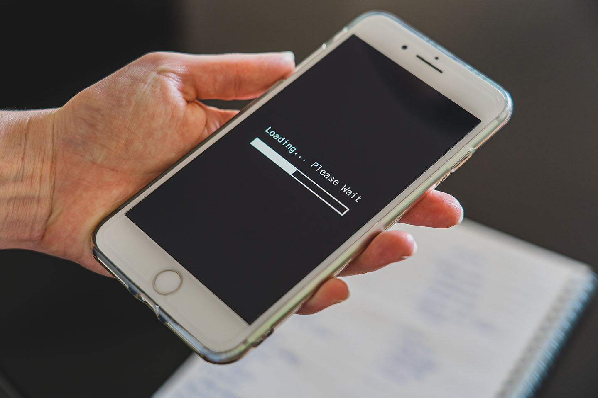

4G網路改變了我們上網的習慣，只要將sim卡插上手機就能上網，不受數據機、網路線的束縛，可以說科技越來越貼近人性。不過隨著4G使用者快速增加，業者的吃到飽口號讓我們越來越吃不飽了。也許是我住的地方是密集的舊式住宅區，住戶眾多，尖峰時段一到，電信公司的線路總是塞爆，8:00 ~ 10:00這段時間，下載速度大概只有低於5Mbps之譜。於是我開始計畫改善收訊狀況，看看網路是否能順一點。

我使用的電信業者是台灣之星，可提供的4G頻段為**B7(2600mhz) / B8(900mhz)**，使用經驗上連B7的速度比B8快上不少，但是B7的訊號卻比較容易受到干擾，因為其電波穿透力較差。我在房間裡連B7，手機訊號大概只有兩格，速度自然比較慢。那麼如果我在收訊較好的陽台，放上一台4G分享器，讓它開wi-fi分享給我的手機，問題不就解決了嗎？最好再連上天線，增加4G訊號的品質。

我上網作了點功課，找了一台支援上述兩個頻段(B7 / B8)的4G分享器，也就是本文的主角：**Netgear Aircard 782s**，它的底部有sim卡插槽，以及兩個TS9天線接頭。我收到機器後，把sim卡壓入插槽，按下開關，螢幕亮起，卻在不久後熄滅，然後它又自個亮起，再熄滅。重複好幾個週期後，我終於進到了分享器的操作主畫面，把**APN / wi-fi密碼**設一設，讓手機連上分享器，螢幕又立刻熄滅，繼續上述的死機重開循環。在經歷無數次故障之後，我釐出了兩個導致重開的要點：

* 開機前就把sim卡插入會導致重開
* 當機器連上LTE也會高機率導致重開  

上網搜尋了分享器重開的問題，發現這並不是個案，外國有許多使用者回報相同的問題，也有許多熱心的網友提供解法：  

1. 接上供電規格較好的變壓器使用(5v，供應電流2A以上)：無效  
2. 更換新的電池：無效  
3. 設定網路使用WCDMA(3G) Only：有效，但是對網路速度改善不大。  
4. 使用AT command限定機器運作頻率，避開特定頻率：有效，後面提到。  
5. 更新韌體：有效。最終解法。  
  
  
### 使用AT command限定機器運作頻率

---

使用AT command的方法，多是在為另一台Netgear M1分享器提昇網路速度的文章中提到。首先，你需要將你的分享器以usb傳輸線連上你的電腦。連上後使用telnet軟體與分享器進行雙向互動(對話)。以我的分享器IP為10.0.0.138為例，首先連上它的5510 port：  
**telnet 10.0.0.138 5510**  

接著查詢分享器狀態：  
**AT!GSTATUS?**  

如果連線正常，分享器將會返回機器現況資訊。
我們現在要操作的BAND設定需要密碼：  
**AT!ENTERCND="A710"**  

如果密碼正確，分享器將會返回OK。請注意，各型號分享器的密碼是不同的。接著查詢BAND資訊：  
**AT!BAND=?**  

分享器將會返回機器的BAND設定選項，以及它支援的BAND列表。
BAND列表中，右方的**L Band Mask**是我們需要的LTE BAND資訊：  
0000000000000080 - B8  
0000000000000040 - B7  
0000000000000004 - B3  
0000000000000001 - B1  

鎖定運作的LTE BAND，我們需要新增設定選項，指令如下：  
**AT!BAND=&lt;index>,"&lt;name>",&lt;GWmask>,&lt;Lmask>**  

如果我想要鎖定B7，則我需要新增一個BAND設定選項：  
**AT!BAND=03,"LTE 2600",0,40**  
在這行指令中，我們新增了索引值03的選項，其名為LTE 2600，GWmask設定為0是因為我們不需要用到3G，Lmask則是設為上述LTE BAND列表的數字(值)，值得注意的是，如果我們要設定支援兩個BAND，像是B7 + B8，則需要把他們的值相加：40 + 80 = c0，這裡的加法是十六進位制的。  
**AT!BAND=04,"LTE 900 / 2600",0,c0**  

如果要鎖定B8:  
**AT!BAND=05,"LTE 900",0,80**  

在設定完成後，可以執行**AT!RESET**，讓分享器直接重開。重開完成後，你應該可以在機器本身設定介面中，找到剛剛設定的網路頻段選項。選擇後，分享器就會鎖定該頻段運作。

在執行限制LTE BAND的設定操作後，我發現這台分享器只能穩定在B8(900mhz)運作，B7(2600mhz)則是非常不穩定，也會進入重開循環。
  
### 更新韌體

---

最後我更新了官方的韌體，所有問題才終於解決，B7也能正常使用。在更新韌體前，請取出sim卡，並將電池充飽電比較保險。
要使用官方的韌體，首先需要一台運行windows電腦，透過usb接上分享器後，先安裝NETGEAR AC782S Driver Package B3978，再執行韌體安裝程式AC782S_BigPond-C1.0.61.0，更新後的韌體版本為NTG9X25C_01.00.61.00：
[官方韌體與驅動程式](https://kb.netgear.com/24282/AirCard-782S-BigPond-Downloads-and-Documentation)

最後，這台分享器到底為我提昇了多少網路速度呢？我在陽台外裝了天線，再接到分享器，尖峰時段房間內的網速都有10Mbps以上，還算是有感的提升，只是一連串的除錯真是太折騰人了。在此留下記錄給需要的人。
